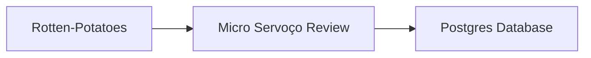

# Micro Serviço de Reviews

O micro serviço de *reviews* é uma aplicação construída em ***.Net Core*** que faz a tratativa do cadastro das recomendações dos filmes do cadastro da aplicação ***Rotten-Potatoes***.

## Estrutura do projeto

Esse projeto trabalha com uma base de dados Postgree

## Configuração

É preciso configurar a *connection string* pra que o serviço acesse o banco de dados *Postgree*. Isso pode ser realizado alterando o arquivo ***src/Review.Web/appsettings.json*** ou definindo como variável de ambiente ***ConnectionStrings__MyConnection***

Exemplo:

    ConnectionStrings__MyConnection:Host=localhost;Database=pguser;Username=pguser;Password=Pg@123;

## Criando a imagem para executar o container

Foi criado dentro do projeto um arquivo  `Dockerfile`  contendo o passo-a-passo (receita de bolo) de criação da imagem  _Docker_  que posteriormente será utilizada para execução da aplicação em um container.

Como boa prática, o  `Dockerfile`  deste projeto faz a construção da imagem em duas etapas para garantir que a imagem que será utilizada para criação do container possua apenas o necessário para execução da aplicação e com isso ficando bem menor que o esperado. 

    FROM mcr.microsoft.com/dotnet/aspnet:5.0 as base
    WORKDIR /app
    EXPOSE 80
    EXPOSE 443
    
    FROM mcr.microsoft.com/dotnet/sdk:5.0 AS build
    WORKDIR /source
    COPY *.sln .
    COPY Review.Web/*.csproj ./Review.Web/
    RUN dotnet restore
    COPY Review.Web/. ./Review.Web/
    WORKDIR /source/Review.Web
    RUN dotnet publish -c Release -o /app --no-restore
    
    FROM base as final
    WORKDIR /app
    COPY --from=build /app ./
    ENTRYPOINT ["dotnet", "Review.Web.dll"]

## Ignorando arquivos desnecessários na criação da imagem

No diretório da aplicação podem existir arquivos indesejados e/ou desnecessários que seriam copiados com o comando  `COPY`  e que poderiam ser ignorados durante o processo de criação da imagem  _Docker_.

Para isso foi criado no mesmo diretório onde se encontram os arquivos do projeto o arquivo  `.dockerignore`  que possui uma lista (com o mesmo padrão do arquivo  `.gitignore`) com os diretórios/arquivos que serão ignorados no momento da execução da cópia dos arquivos para dentro da imagem.

## Executando ambiente da aplicação

Como o ambiente é formado por uma [aplicação web principal](https://github.com/nossadiretiva/rotten-potatoes-ms), um [micro serviço de *review*](https://github.com/nossadiretiva/review) e um [micro serviço de filme](https://github.com/nossadiretiva/movie), a configuração deste ambiente ficou a cargo do *Docker Compose*, que se encontra no diretório da aplicação principal.

Segue abaixo o trecho que configura o micro serviço de *review*:

      review-service:
        build:
          context: ../review/src
          dockerfile: Dockerfile
        container_name: review-service
        image: nossadiretiva/review-service:v1
        ports:
          - 8282:80
        networks:
          - movie_network
        depends_on:
          - postgresdb
        environment:
          ConnectionStrings__MyConnection: Host=postgresdb-movie;Database=review;Username=pguser;Password=Pg@123;
    
      postgresdb:
        container_name: postgresdb-movie
        image: postgres:14.1-alpine
        ports: 
          - 5432:5432
        networks:
          - movie_network
        volumes:
          - postgresdb_movie_vol:/var/lib/postgresql/data
        environment:
          POSTGRES_USER: pguser
          POSTGRES_PASSWORD: Pg@123
          POSTGRES_DB: review
